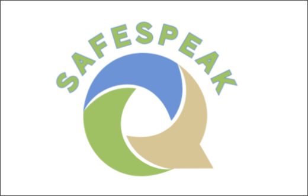

# SafeSpeak

[](https://www.python.org/downloads/)
[](https://pytorch.org/)
[](https://jupyter.org/)
[](https://scikit-learn.org/)
[](https://creativecommons.org/licenses/by-nc/4.0/)
[](https://github.com/SafeSpeak-ML/SafeSpeak/issues)
[](https://github.com/SafeSpeak-ML/SafeSpeak/stargazers)
[](https://github.com/SafeSpeak-ML/SafeSpeak/network)
[](https://www.findahelpline.com/)

<div align="center">
  
</div>

## 🛡️ About SafeSpeak

SafeSpeak is an advanced machine learning model designed to detect potentially suicidal content in text. Built with PyTorch and utilizing LSTM neural networks, this tool aims to provide early intervention capabilities for mental health support systems.

> **⚠️ Important Disclaimer**: This tool is designed to assist mental health professionals and support systems. It should not be used as the sole method for crisis intervention. If you or someone you know is in crisis, please contact local emergency services or a crisis hotline immediately.

## 🚀 Features

- **Real-time Text Analysis**: Fast prediction of suicidal ideation in text
- **LSTM Neural Network**: Deep learning model trained for text classification
- **Custom Stopwords Processing**: Enhanced text preprocessing for better accuracy
- **Asynchronous Processing**: Efficient handling of multiple text inputs
- **GPU Support**: CUDA acceleration when available
- **Lightweight Deployment**: Easy integration into existing systems

## 🏗️ Architecture

The model uses a sophisticated architecture combining:

- **Embedding Layer**: Word embeddings for semantic understanding
- **LSTM Network**: Sequential processing for context awareness
- **Fully Connected Layer**: Final classification output
- **Custom Preprocessing**: Stopwords filtering and text normalization

## 📦 Installation

### Prerequisites

- Python 3.8 or higher
- CUDA-compatible GPU (optional, for acceleration)

### Setup

1. Clone the repository:

```bash
git clone https://github.com/SafeSpeak-ML/SafeSpeak.git
cd SafeSpeak
```

2. Install required dependencies:

```bash
pip install -r requirements.txt
```

3. Download NLTK data:

```python
import nltk
nltk.download('punkt')
nltk.download('stopwords')
```

### Dependencies

The project includes essential dependencies in `requirements.txt`:

- **Core ML**: PyTorch, torchtext
- **Data Processing**: pandas, numpy, nltk
- **Training & Evaluation**: scikit-learn
- **Visualization**: matplotlib (for training notebook)
- **Development**: Jupyter notebook support

## 🔧 Usage

### Basic Usage

```python
from src.model import predict

# Analyze text for suicidal content
text = "Your input text here"
result, processing_time = await predict(text)

if result is None:
    print("Text too short for analysis")
elif result:
    print(f"⚠️ Potential risk detected (processed in {processing_time:.2f}ms)")
else:
    print(f"✅ No risk detected (processed in {processing_time:.2f}ms)")
```

### Model Details

- **Input**: Raw text (minimum 50 characters)
- **Output**: Binary classification (risk/no risk) + processing time
- **Processing**: Automatic preprocessing including stopword removal and tokenization

## 📊 Model Performance

The model has been trained to balance sensitivity and specificity for mental health applications. Performance metrics include:

- **Minimum Text Length**: 50 characters for reliable prediction
- **Processing Time**: Typically <100ms per prediction
- **GPU Acceleration**: Automatic CUDA detection and utilization

## 🗂️ Project Structure

```text
SafeSpeak/
├── README.md                 # You are here
├── LICENSE                    # Creative Commons BY-NC 4.0 License
├── requirements.txt           # Essential Python dependencies
├── assets/
│   └── logo.png              # Project logo
├── model/
│   ├── dectection.pth        # Trained model weights
│   └── vocab.pkl             # Vocabulary mapping
├── src/
│   ├── model.py             # Main model and prediction logic
│   ├── classfier.py         # text classifier class
│   └── stops/
│       ├── __init__.py # init the folder
│       ├── processing.py # preprocess funcs
│       ├── stop.py # create stopwords
│       └── texts           # Custom stopwords
│           ├── general.txt # normal words
│           └── slang.txt   # slang text
├── train/
│   ├── safespeak.ipynb      # Training notebook
│   └── Dataset/
│       └── Suicide_Detection.csv # Training dataset
└── tests/                   # WIP
```

## 🎓 Training

The model was trained using the Jupyter notebook in `train/safespeak.ipynb` with:

- **Dataset**: Suicide_Detection.csv containing labeled text samples
- **Architecture**: LSTM-based neural network with embedding layers
- **Training Split**: 70% training, 30% validation
- **Evaluation Metrics**: Precision, recall, and F1-score
- **Framework**: PyTorch with scikit-learn for metrics

## 🤝 Contributing

We welcome contributions to improve SafeSpeak's accuracy and capabilities:

1. Fork the repository
2. Create a feature branch (`git checkout -b feature/improvement`)
3. Commit your changes (`git commit -am 'Add new feature'`)
4. Push to the branch (`git push origin feature/improvement`)
5. Create a Pull Request

### Areas for Contribution

- Model accuracy improvements
- Additional preprocessing techniques
- Performance optimizations
- Test coverage expansion
- Documentation enhancements

## 📋 Roadmap

- [ ] Add proper testing suite
- [ ] Add model evaluation metrics
- [ ] Add multi-language support
- [ ] Improve model accuracy with larger datasets

## 🆘 Crisis Resources

If you or someone you know is experiencing a mental health crisis:

- **National Suicide Prevention Lifeline**: 988 (US)
- **Crisis Text Line**: Text HOME to 741741
- **International Association for Suicide Prevention**: [https://www.iasp.info/resources/Crisis_Centres/](https://www.iasp.info/resources/Crisis_Centres/)

## 📄 License

This project is licensed under the Creative Commons Attribution-NonCommercial 4.0 International License - see the [LICENSE](LICENSE) file for details.

**Key License Terms**:

- ✅ **Share**: Copy and redistribute the material
- ✅ **Adapt**: Remix, transform, and build upon the material  
- ⚠️ **Attribution Required**: Must give appropriate credit
- ❌ **Non-Commercial**: Cannot be used for commercial purposes

## 🙏 Acknowledgments

- Built for the Congressional App Challenge
- Mental health awareness and suicide prevention advocacy
- Open source community contributions
- PyTorch and NLTK development teams
- [Suicide Watch Dataset](https://www.kaggle.com/datasets/nikhileswarkomati/suicide-watch), thank you for your wonderful work of collecting all this data.

- Copilot was used during development of this project, primarily for writing quick (and ommited) tests, as well as majority of this readme

## 📞 Support

For technical support or questions:

- Open an issue on [GitHub Issues](https://github.com/SafeSpeak-ML/SafeSpeak/issues)
- Contact the development team

---

<div align="center">
  <strong>Together, we can make a difference in mental health support.</strong>
</div>
